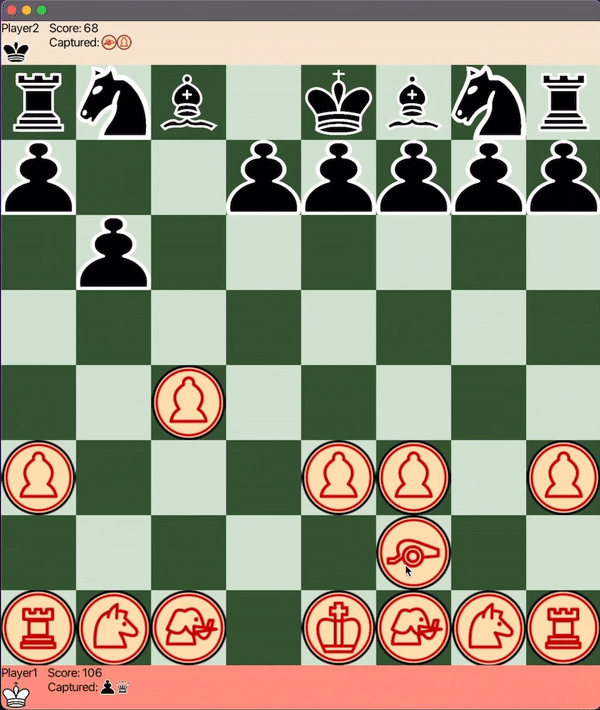

# Chess Variants and AI Player

### A variant of chess 'Chess vs Chinese Chess' and AI player

## Project Overview

This project implements two games, 'Chess' and 'Chess vs. Chinese Chess.' The variant 'Chess vs. Chinese Chess' is a board
game that my grandfather and I used to play when I was young. I plan to add multiplayer support so that others can enjoy this unique Chess variant.

All classes are well-refactored and follow the OOP principle and MVC pattern. I implemented the Chess game first and used the existing classes to create 'Chess vs. Chinese Chess.'
## AI Player 
Created an AI player using the Minimax algorithm with alpha-beta pruning. The current setting checks up to step 2 for performance issues from recursion.
I plan to add AI players that use more complex algorithm in the future.
## Resources Used

- https://www.javatpoint.com/how-to-get-value-from-json-object-in-java-example https://mkyong.com/java/java-properties-file-examples/
- https://www.geeksforgeeks.org/minimax-algorithm-in-game-theory-set-1-introduction/
- https://en.wikipedia.org/wiki/Xiangqi
- https://en.wikipedia.org/wiki/Chess

